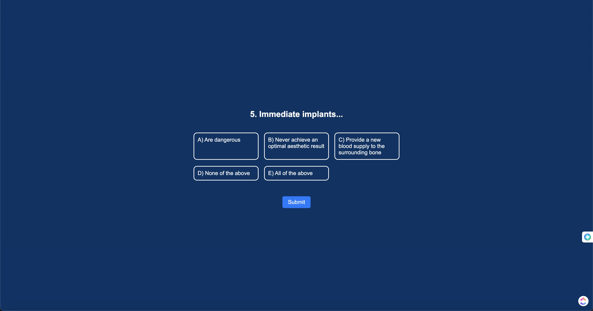

# 📚 Project Name: Periospot Quiz

## 📖 Table of Contents

1. [Introduction](#introduction)
2. [Overview](#overview)
3. [Features](#features)
4. [User Experience (UX)](#user-experience-(ux))
5. [Surface](#surface)
6. [Technology Stack](#technology-stack)
7. [Testing](#testing)
8. [Bugs and Resolutions](#bugs-and-resolutions)
9. [Deployment](#deployment)
10. [Citation of Sources](#citation-of-sources)
11. [Acknowledgements](#acknowledgements)
12. [Contact & Support](#contact-&-support)

## 🎯 Introduction
The Periospot Quiz is an engaging and dynamic web application tailored for dental professionals seeking to evaluate and enhance their knowledge in specialized fields such as implant dentistry and periodontics. This educational tool serves a dual purpose: it not only gauges the proficiency levels of its users through a series of carefully curated questions but also offers personalized content recommendations based on their quiz performance.

The quiz experience is designed to be both informative and enjoyable, presenting an innovative approach for dentists to self-assess their expertise. Upon completion, participants are provided with a score that accurately reflects their current understanding of the subject matter. Moreover, the application intelligently suggests relevant educational materials that align with the user's scoring bracket.

There are three distinct outcomes catered to varying levels of expertise: beginner, intermediate, and advanced. Each outcome directs the user to a unique landing page, which showcases tailored content designed to elevate their dental practice to the next level. Beginners who score below a certain threshold receive resources that lay down foundational knowledge, intermediates are guided towards content that builds upon their existing skills, and advanced users are offered in-depth material to delve deeper into the complexities of implant dentistry and periodontics.

This approach ensures that every dental professional, regardless of their initial skill level, is given a clear path for professional growth and learning. The Periospot Quiz not only stands as a testament to interactive learning but also as a beacon for continuous professional development in the ever-evolving world of dental medicine.

## 🌐 Overview

The Periospot Quiz is a demonstration of proficiency in HTML, CSS, and JavaScript, showcasing a mobile-first design that responds intuitively across devices from smartphones to desktops. The application is compatible with major browsers including Chrome, Firefox, Edge, and Safari.
This interactive quiz challenges dental professionals with a series of questions tailored to their specialization in implant dentistry and periodontics. Designed with user engagement in mind, the quiz offers multiple-choice questions with a single correct answer to test the user's knowledge. Accessibility is a cornerstone of the application's design, allowing full functionality via keyboard navigation and compatibility with screen readers.

The quiz is not just a test but an educational journey, culminating in personalized content recommendations based on the user's performance. These recommendations aim to guide users toward enhancing their professional knowledge, whether they are just starting out or looking to deepen their expertise in the field. Through a seamless blend of assessment and learning, the Periospot Quiz stands out as an innovative educational tool for dental professionals.

## 🛠️ Features
Existing Features

Index / Home Page

Responsive design that adapts to various screen sizes, ensuring a seamless experience on devices ranging from mobile phones to desktop computers.

Home Page on a small screen

Home Page on a large screen

The Home Page includes:

Quiz Introduction
A compelling introduction invites dental professionals to engage with the quiz, offering a brief explanation of its purpose and the educational value it provides.

Username Input
A user-friendly input field prompts users to enter their name, which personalizes the experience. An error prompt ensures users cannot proceed without providing a valid username.

Start Button
A prominently placed Start Button initiates the quiz. Its design includes accessibility features like keyboard focus and hover effects for better user interaction.

Quiz Questions

Questions are crafted to challenge and reflect the user's expertise in implant dentistry and periodontics, with interactive multiple-choice answers.

Results and Feedback

The quiz concludes with a results page that provides immediate feedback on the user's performance, complete with encouragement and suggestions for improvement or further learning.

Accessibility

The entire quiz is designed with accessibility in mind, ensuring that users can navigate through questions and interact with the quiz using keyboard shortcuts and screen readers.

### Future Features

To enhance the Periospot Quiz further, the following features are under consideration:

Advanced Personalization

Integrating more sophisticated algorithms to tailor content recommendations even more closely to user scores and responses.

Dynamic Question Bank

Incorporating a larger pool of questions to prevent repetition and keep the quiz challenging and engaging over multiple attempts.

Progress Tracking

Adding a feature to track user progress over time, allowing users to see their improvement and areas that need focus.

Social Sharing

Enabling users to share their quiz results on social media, promoting both their own achievements and the Periospot Quiz itself.

Community Engagement

Creating a platform for users to discuss quiz topics, fostering a community of dental professionals who can learn from and support each other.

## 🧠 User Experience (UX)

### Strategy / Site Goals

Periospot Quiz is designed to be an educational and engaging tool for dental professionals at various stages of their careers. The application serves to evaluate their knowledge in specific areas of dental practice such as implant dentistry and periodontics, and based on their performance, suggests resources for further learning. This encourages continuous professional development and keeps users updated in their field.

The primary goal of Periospot Quiz is to offer a user-friendly platform where dental professionals can assess their knowledge and receive tailored content recommendations to advance their expertise. The site aims to be accessible, intuitive, and entertaining for users, providing a productive break from their routine with the added benefit of learning reinforcement.

### Scope / User Stories

#### Users will be able to:

Quickly grasp the purpose of the quiz and its relevance to their professional growth.
Navigate through the quiz effortlessly, regardless of the device being used.
Receive immediate feedback on their answers and overall quiz performance.
Be directed to suitable educational materials based on their quiz results.
Be encouraged to retake the quiz to improve their score and knowledge.
Contact the quiz creators for support, feedback, or suggestions.
Structure / Design Choices
Periospot Quiz adopts a clean and professional design approach, reflecting the serious nature of the dental profession while still maintaining a sense of engagement and fun. The interface is streamlined to minimize distractions and focus users on the content.

The quiz layout is straightforward, with a header for branding and navigation, and a footer containing additional resources and contact information. This consistency in structure across the platform ensures a seamless user experience.

Each question is presented with a clear and readable font, with corresponding answer options immediately below. On larger screens, the layout adapts to display answer options more compactly, allowing users to view navigation controls without the need to scroll.

The final score display not only provides users with their results but also includes a visual element for added engagement. Personalization is heightened with the user's name being incorporated into the feedback, making the experience more interactive and tailored.

For in-depth descriptions of specific features and the rationale behind design choices, please refer back to the Features section.

## 🎨 Surface

### Color Scheme

Periospot Quiz utilizes a color palette that combines professionalism with a touch of modernity to create a visually appealing and intuitive user experience. The chosen colors aim to reflect the innovative spirit of the dental profession while maintaining visual comfort for extended periods of use.

Dark Blue (#013366): This deep, trustworthy shade sets a professional tone for the quiz interface.
Light Blue (#0099CC): Used for interactive elements and to highlight important features, offering a refreshing contrast.
Strong Yellow (#B98C3C): Employed sparingly for calls to action and to draw attention to key results and scoring.
Grey (#333333): Provides a neutral backdrop for question and answer sections, ensuring readability.
Each color has been selected to ensure adequate contrast and readability across various devices and lighting conditions.

Typography
The quiz interface employs a clean and straightforward typographical approach to ensure clarity and ease of reading:

Arial Black: Utilized for headings to capture attention and convey significance.
Arial: The primary typeface for questions and content, offering a balance between readability and information density.
Sans-serif: Used for supplementary text, providing a modern and clean aesthetic that complements the primary typefaces.
This combination of typefaces ensures a hierarchical structure that guides users naturally through the quiz flow, from questions to answers and results.

The thoughtful application of these design elements creates an environment that is not only visually engaging but also conducive to focus and learning, reflecting the educational goals of Periospot Quiz.

### Images

All the illustrations are original and designed by Francisco Teixeira Barbosa. The images are illustrations to make the user better understand the clinical and scientific message. The images are not intended to be used for diagnostic purposes but can be used also for presentations and to explain simple concept to patients.

The images were designed using Adobe Illustrator.

Access to illustrations in (documentation/illustrations)

The animation on question 6 was produced on Adobe After effects and then exported to a .gif. Full animation here (documentation/animations)

## Technology Stack
- HTML (index.html, scorehigh.html, scorelow.html, scoremedium.html)
- CSS (styles.css)
- JavaScript (main.js, score.js)

## Testing

To ensure a robust and error-free user experience, extensive testing has been conducted across all components of the Periospot Quiz application. The following tests and validators have been used to verify the integrity and standards compliance of the codebase:

Validator Testing

### HTML Validation:

The HTML code of the application, including index.html, scorehigh.html, scorelow.html, and scoremedium.html, has been tested using the Official W3C Markup Validator. The validator confirmed that all documents were checked and found to have no errors or warnings, ensuring adherence to web standards and compatibility across browsers.

### CSS Validation:

The stylesheet styles.css passed through the Official W3C CSS Validator for CSS level 3 + SVG. The validator returned a congratulatory message, indicating no errors were found, which confirms the quality and standards-compliance of the CSS code.

### JavaScript Validation:

The JavaScript code was validated using the Official Jshint Validator, configured for ES6 syntax. The validator returned the following metrics:

28 functions in the file.
The function with the largest signature takes 1 argument.
The largest function contains 31 statements.
The most complex function has a cyclomatic complexity of 3.
While 37 warnings were reported, these were related to the use of ES6 features such as arrow functions, let, and const, which are standard in modern JavaScript development. As the application is intended for environments where ES6 support is available, these warnings do not affect the functionality and have been acknowledged for future reference.

### Testing Conclusion

The successful passing of the code through various validators without errors or warnings is a testament to the meticulous development process and adherence to modern web standards. This ensures that Periospot Quiz delivers a consistent and reliable user experience.

## Lighthouse Performance Audit

The Periospot Quiz application has undergone a thorough audit using Lighthouse, an open-source, automated tool for improving the quality of web pages. The audit focuses on various aspects of the application, including performance, accessibility, best practices, and SEO. The results provide insights into areas where the application excels and opportunities for improvement.

### Audit Summary

#### Performance: 

Achieved a score of 94, indicating that the application loads quickly and has efficient rendering behavior.

#### Accessibility: 

Scored an impressive 91, suggesting that the application is well-tuned for users with accessibility needs, although there is room for minor improvements.

#### Best Practices: 

With a score of 92, the application follows industry-standard best practices for web development.

#### SEO: 

Received a score of 92, which shows that the application is well-optimized for search engine visibility.

### Detailed Metrics

* First Contentful Paint: 1.0 s
* Largest Contentful Paint: 1.5 s
* Total Blocking Time: 0 ms
* Cumulative Layout Shift: 0.157
* Speed Index: 1.0 s

### Opportunities for Optimization

* Cache Policy: Some static assets can benefit from a longer cache policy to improve load times on repeat visits.
* Image Optimization: Conversion of some images to next-gen formats like WebP could result in size reductions and faster loading times.
* Critical Requests: Minimizing the number of critical requests can improve load times.
* Main-thread Tasks: Avoid long main-thread tasks to reduce the potential for input delay.

### Accessibility Insights

* Color Contrast: A few elements could be improved for better visibility and contrast.
* Image Attributes: Ensuring all images have explicit width and height to reduce layout shifts.

### Best Practices for Trust and Safety

* Content Security Policy (CSP): Implementing a CSP to protect against XSS attacks is recommended.

### SEO Enhancements

* Meta Description: Adding a meta description can provide search engines with a summary of the web page's content.
* Viewport Configuration: Ensuring the viewport size is configured correctly for the device.

### Progressive Web App (PWA) Considerations

The application currently does not meet all the installability requirements for a PWA. Future enhancements could include:

* A web app manifest with appropriate icons and theme colors.
* Ensuring content is sized correctly for the viewport.
* Creating a seamless experience across browsers and ensuring each page has a unique URL.

### Conclusion

The Lighthouse audit demonstrates a strong performance profile for the Periospot Quiz application, with excellent accessibility and adherence to best practices. While the SEO is well-configured, there is a potential to enhance the application's installability as a Progressive Web App. These insights will guide future development to ensure the application continues to deliver an optimal user experience.

### Manual Testing

#### Browser Compatibility

The Periospot Quiz has been manually tested across various browsers to ensure broad compatibility and consistent experience. The application performs well on:

- Google Chrome: Full functionality with smooth interactions.
- Mozilla Firefox: Consistently responsive with all features accessible.
- Microsoft Edge: Compatible with no detected issues.
- Safari (Mobile): Fully operational with touch responsiveness on Apple devices.

#### Device Compatibility and Responsiveness

The application's responsiveness was rigorously tested using Chrome and Edge Developer Tools to simulate a range of devices. The Periospot Quiz is confirmed to be responsive and provides an optimal user experience for screens as small as 320px in width.

In addition to virtual emulations, physical testing was conducted on various devices, including smartphones and tablets, across different operating systems. Participants, including dental professionals and students, accessed the quiz without encountering functional or responsive issues. The application's compatibility with assistive technologies such as screen readers was also verified, ensuring inclusivity for users with disabilities.

#### Accessibility and Navigation

Special attention was given to keyboard navigation and voice commands to cater to users who rely on assistive technologies. Tests were performed to ensure that all interactive elements are focusable and accessible via keyboard shortcuts, and that voice commands are recognized accurately on devices that support voice input.

#### Manual Testing Bug Fixes

During the manual testing phase, a few bugs were identified and subsequently fixed:

- Keyboard Navigation: An issue with keyboard navigation flow was identified and not solved. There is a conflic in the js file not solved. 

### 6. Bugs and Resolutions

#### Encountered Issues and Resolutions

**Issue 1:** Unchecked runtime.lastError: Encountered in Chrome DevTools, indicating that the message port closed before a response was received.
   - **Resolution:** Disabled all browser extensions and then re-enabled them one by one. Identified that a specific extension was causing the issue, which was then kept disabled.

**Issue 2:** Page Refresh on Start: The quiz page refreshed when the "Start" button was clicked, which was caused by the default behavior of the `<input type="submit">` within a form.
   - **Resolution:** Changed the button type to `<input type="button">` to prevent form submission and page refresh.

**Issue 3:** Username Input Validation: The validateUserInput() function incorrectly flagged three-character usernames as invalid due to a zero-based index count.
   - **Resolution:** Adjusted the validation logic to account for the index starting at zero.

#### Bugs Left Unfixed

**Bug 1:** Image Responsiveness: Certain images, including GIFs, were not displaying properly across all screen sizes, causing layout issues.
   - **Current Status:** Adjusted image sizes and ensured responsiveness, which solved the issue for most cases. Ongoing adjustments for optimal display across all devices.

**Bug 2:** Enter Key Navigation: The application does not progress to the next page upon pressing the Enter key.
   - **Current Status:** Investigating the main.js file to identify and resolve the underlying cause.

**Bug 3:** Element Alignment and Responsiveness: Aligning elements, particularly for different types of answers (GIFs, images, text), was challenging to maintain a consistent and responsive design.
   - **Current Status:** Achieved a uniform look after several iterations and fine-tuning.

**Bug 4:** iOS VoiceOver on Score Display: VoiceOver on iOS does not read from the first element on the Score Display.
   - **Current Status:** Requires additional testing and research for a solution.

#### Manual Testing Bug Fixes

**Fix 1:** Hidden Radio Buttons: During manual testing, hidden radio buttons were included in the keyboard navigation sequence.
   - **Resolution:** Applied display:none to visually hidden elements, removing them from the tab order and screen readers.

**Fix 2:** Inconsistent Button Styling on iOS: The 'Start' button styling was inconsistent due to iOS default styles.
   - **Resolution:** Overrode default iOS styling with custom CSS to match the design of other buttons.

**Fix 3:** Radio Button Label Visibility on iOS: Selected radio button labels were difficult to read due to hover/focus styles.
   - **Resolution:** Modified CSS to improve text readability and removed hover styles for mobile devices.

7. Deployment
The Periospot Quiz application is deployed on GitHub Pages. To accomplish this, the following steps were taken:

1. Navigate to the [GitHub Repository](https://github.com/Tuminha/Periospot_Quizz).
2. Under the repository name, click on the "Settings" tab.
3. Scroll down to the "GitHub Pages" section.
4. Under "Source," select the main branch as the source for your GitHub Pages.
5. Once selected, the page will be automatically refreshed, and a link to the deployed website will be provided.
6. The deployed application can be accessed [here](https://tuminha.github.io/Periospot_Quizz/).

8. Citation of Sources
The Periospot Quiz application was inspired by a combination of resources:

1. Interactive learning from Code Institute's Full Stack Software Development Program.
2. Creative design ideas and snippets from platforms like CodePen and Dribbble.
3. The logo, inspired by the periodic table, was personally designed to echo the themes of science and knowledge.
4. Technical solutions and community support from Stack Overflow.

9. Acknowledgements
I would like to express my profound gratitude to the following:

- My family: My wife and five children, for their unwavering support and encouragement throughout this journey.
- The Code Institute Student Care Team: For their understanding and assistance during my health challenges.
- The broader development community: For the plethora of open resources that have facilitated my learning.
- The Code Institute mentor team: While I have not sought direct assistance from them for this project, their work is greatly appreciated and I look forward to engaging with them in future projects.
- My commitment to self-reliance in this project was a challenge I set for myself, and I am grateful for the opportunity to learn through this process.

## Contact & Support
- Contact: Francisco Barbosa, cisco@periospot.com
- For support, feedback, or queries, please reach out to the above email.
